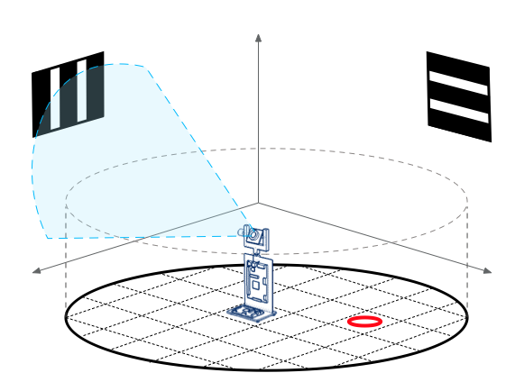
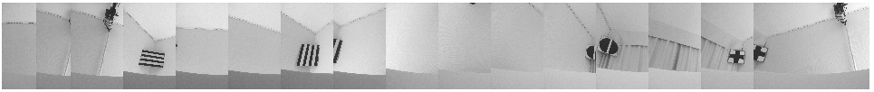
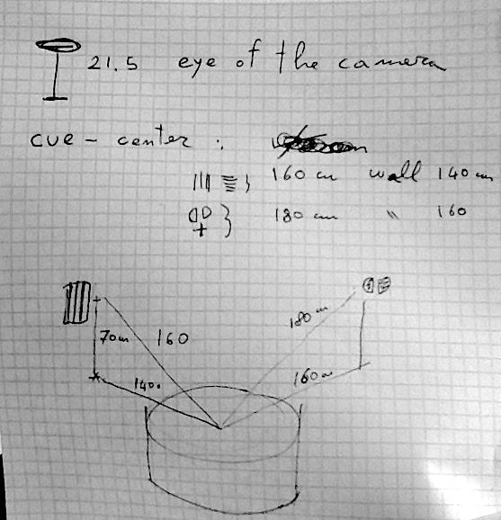

# open-water-maze
 Water Maze environment for comparing spatial navigation in biological and artificial agents

## Images

- the set of images labeled as A are taken at standard vertical angle (30 degrees relative to the horizon).
  the set of images labeled as B are taken at a vertical angle of 60 degrees relative to the horizon.
  The horizon is defined as the water surface

- small images have been converted to 128 x 56 8-bit images
- small_median images have been first converted to 128 x 56 8-bit images then a median filter (size = 1px) has been applied

## misc.

The environment has 16 (views) * 45 (positions) = 13,520 states

### Watermaze specifics

