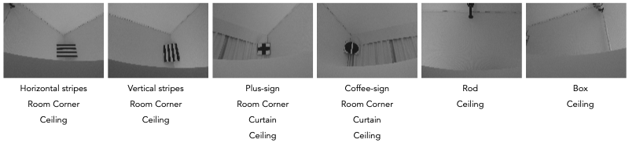
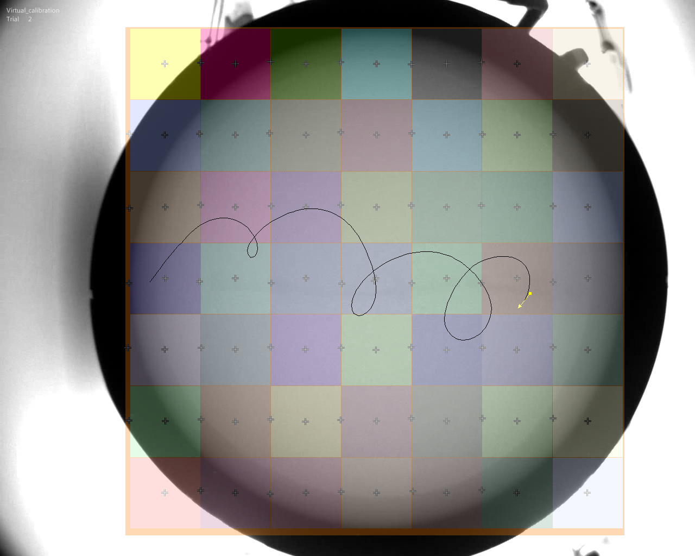
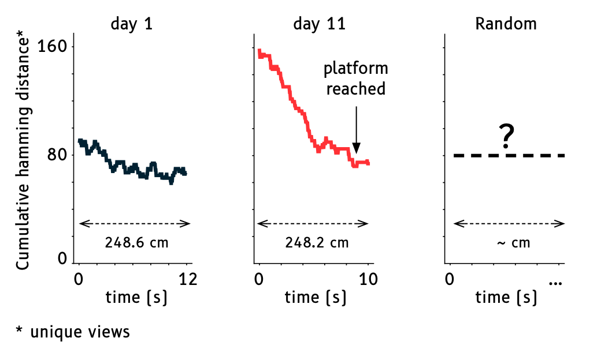

# Open-Water-Maze
Digital reconstruction of a real Water Maze environment for comparing spatial navigation in biological and artificial agents

The **"Open-Water Maze" (OWM)** is an open resource to promote the adoption of *in-silico* experiments in behavioral neuroscience.

The OWM is a digital reconstruction of a real environment (i.e. a water maze) used to:

> 1. Assess **exploration vs exploitation strategies** used by biological agents (i.e. mice) navigating the water maze

> 2. **Compare biological and artificial agents** in the (~)same  spatial navigation task

The OWM is based on two _strong_ assumptions:

1. Rodents use vision to solve the task

2. The rodents' field of view is constrained (i.e. mostly frontal and overhead) due to the head's position in the water

## Digital Reconstruction

### Grid

A grid (7 x 7 cells, cell's side = 20 cm) was overlaid on the floor of empty the pool (diameter = 140 cm). Forty-five cells covered the entire floor of the pool, the 4 corner cells were excluded.

### Hardware
A robot (Arduino + Raspberry Pi 3 equipped with a PiNoIR camera) was placed on the floor of the empty water maze and it acquired 360 degrees pictures of the room from each of the 45 cells. The eye of the camera was placed at 21.5 cm from the floor of the pool. The camera's position was controlled by a two servo motors (vertical and horizontal movement) connected to arduino. The robot was placed sequentially on each cell (N = 45). A total of 16 images (separated by 22.5° interval) were acquired at each of the 45 cells (i.e. positions) covering the floor pool.

### Views

The camera acquired pictures at two different vertical angles (30° and 60°, relative to the horizon - the water surface @ 21.5 cm from the floor of the pool) to reproduce the (estimated) field of view of a rodent swimming inside the pool.

The pool is located in an evenly illuminated and visually homogeneous room (white walls, white ceiling, and a white curtain). Only four salient cues are placed at the corners of the room (distance form the pool center: ~170 cm). Additional cues include a rod on the ceiling that holds the camera used for behavior tracking and a white curtain. The 8-bit Images (N = 720; 2 vertical angles) are available in two different formats (1920 × 1080; 128 x 56)

## Example: information content analysis

The following is a simple analysis of the information content present in each field of view (i.e. not necessarily the best way to compute the information change when moving from one view to the next one)

### Methods
Each image was visually inspected to code for the presence or absence of the following visual cues: 

Vertical-stripes, Horizontal-stripes, Plus-sign, Coffee-sign, Rod, Box, Wall/ceiling border, Curtain, and the Corners of the room.

For each image a vector coding for the presence (1) or absence (0) of the 9 salient cues was generated, resulting in a 720 x 9 matrix. For each position and for each image, the hamming distance between an image and the 2 adjacent images (i.e. representing a left or right turn, yielding a ±22.5° change of view) was computed. The resulting 2 vectors where averaged to produce the expected information content of each individual view.

This results in a virtual grid where each position contains 16 different views. Each view is associated to a value (hamming distance) representing the expected information content of that particular view. We could then imagine the rodent navigating through these states (i.e. position + view) collecting visual information as it searches for the platform.

The resolution of the grid overlaid on the pool is rather low (each cell is 20 x 20 cm), and the rodent goes through different views inside the same cell before moving to a different positon. Indeed, this seems to happen when the rodent is actively searching for the platform.

_**Trajectory of a mouse navigating the 'real' water maze**. The mouse swims inside each position and it goes through multiple views in each cell - see for example, the orange trajectories._

Overlaying the virtual grid on the swim paths of rodents searching for the platform using a behavioral tracking software (EthovisionXT 15, Noldus) allows the reconstruction of the estimated views gathered by the mouse during the navigation using its positon and direction in each grid.

Since each view is associated with an expected information content, the trajectory can be summarized by the collection of unique visits to each view and compute the cumulative hamming distance for the trajectory.

### Results
Here we compared the first ~248 cm of the trajectories of a single mouse on probe-day 1 (first day of training) and  11 (last day of training). At day 11 the mouse takes a trajectory that yields an elevated information content relative to day 1. It would be interesting to compute the cumulative hamming distance for a 'random' trajectory. Ideally, this procedure should detect the point in time when the mouse switches between an exploration to an exploitation strategy

## Notes.

- the set of images labeled as A are taken at standard vertical angle (30 degrees relative to the horizon).
  the set of images labeled as B are taken at a vertical angle of 60 degrees relative to the horizon.
  The horizon is defined as the water surface

- small_median images have been first converted to 128 x 56 8-bit images then a median filter (size = 1px) has been applied

### Watermaze specifics

